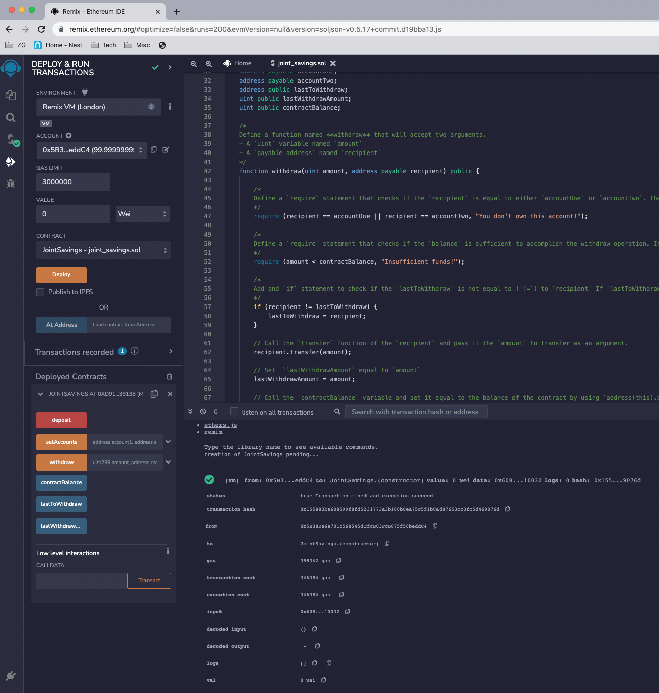
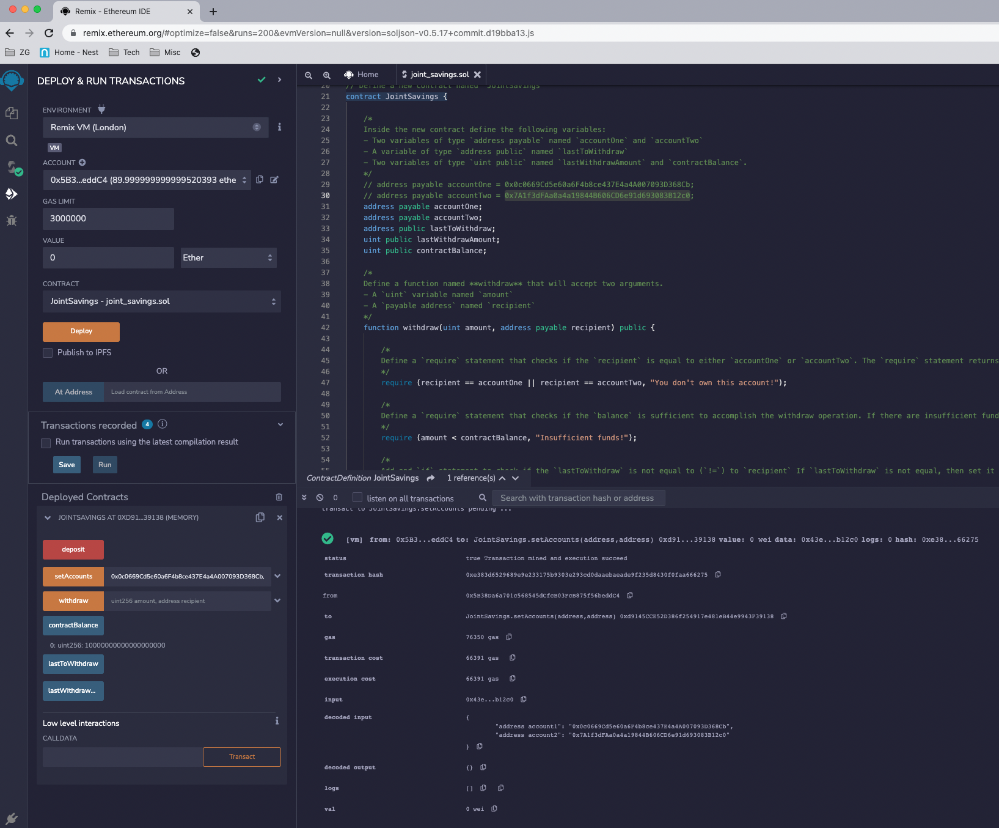
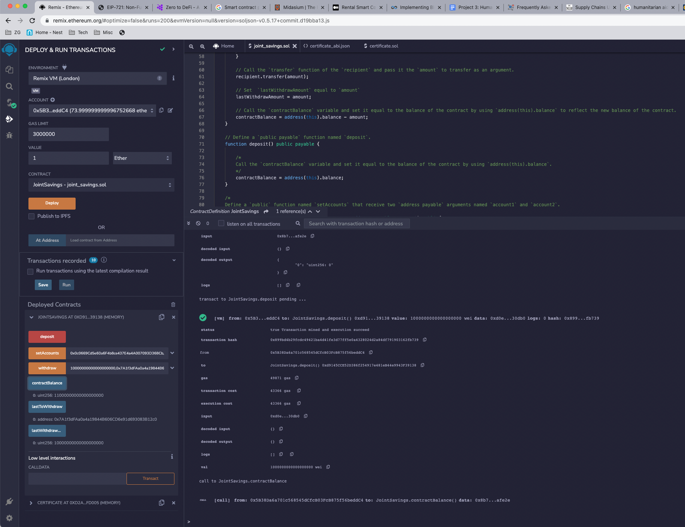
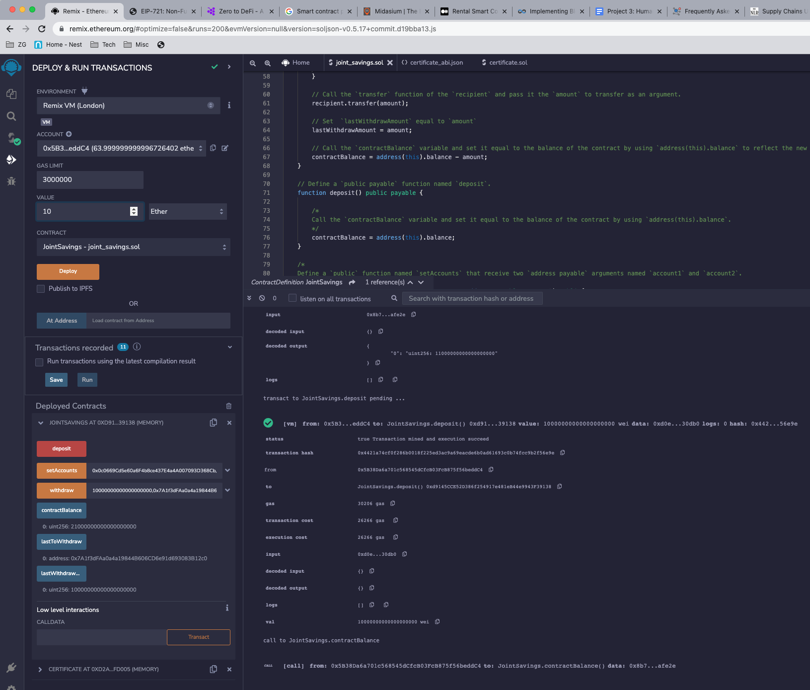
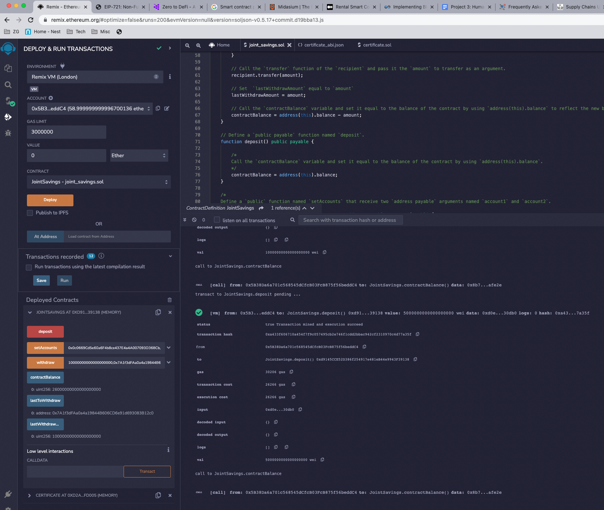
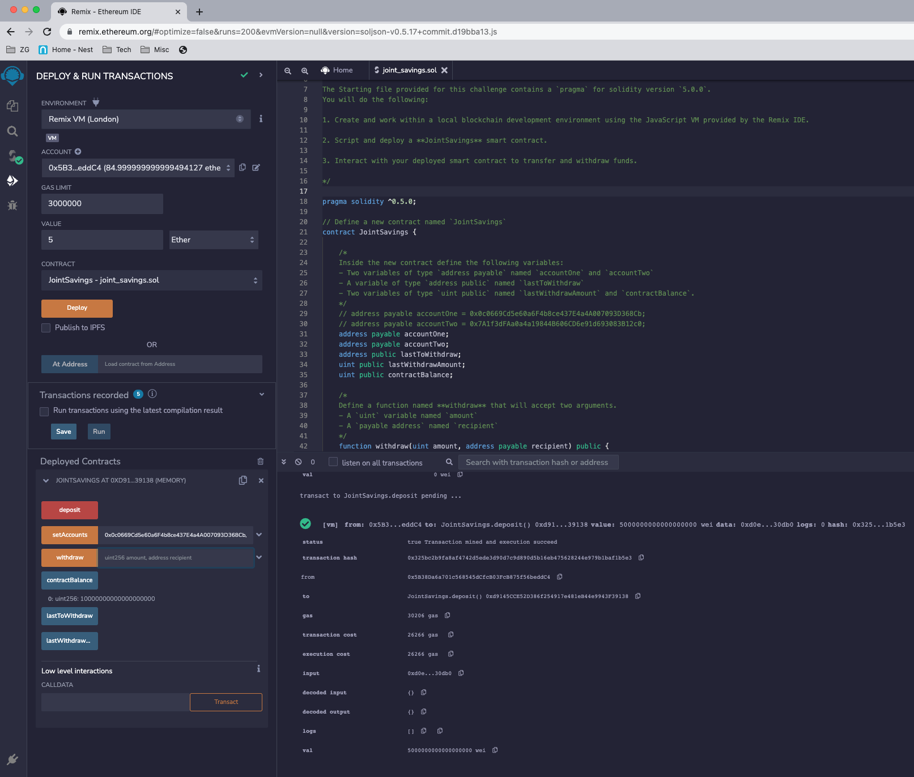
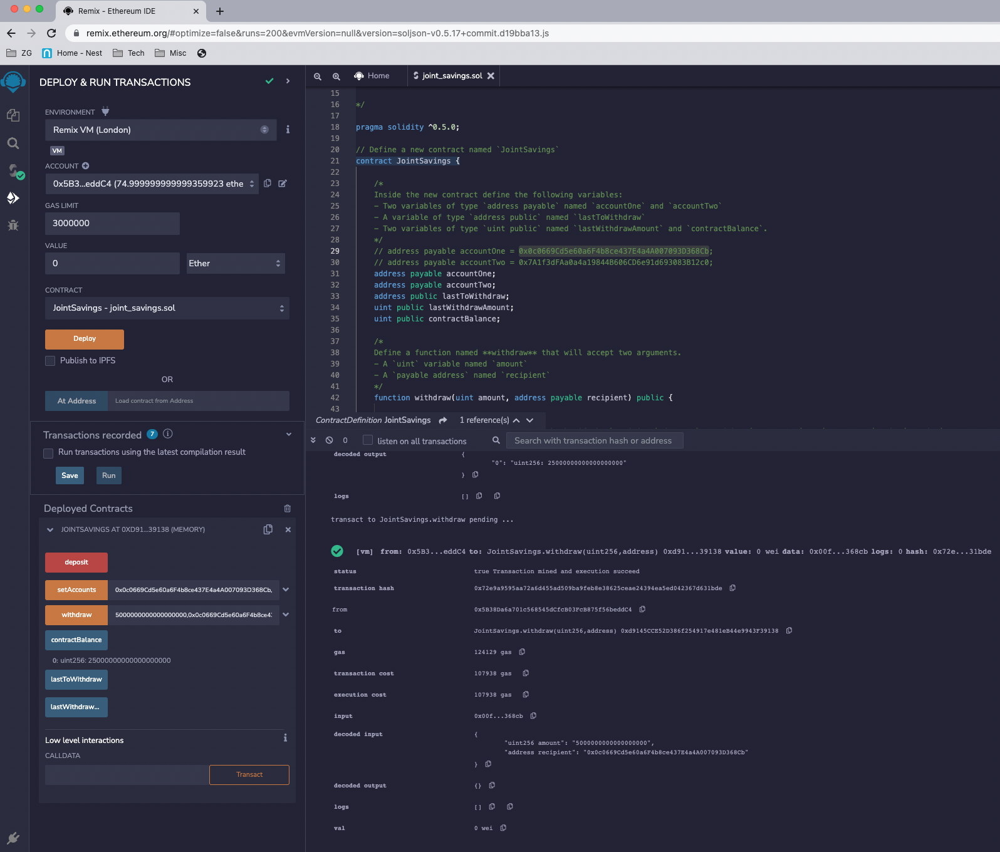
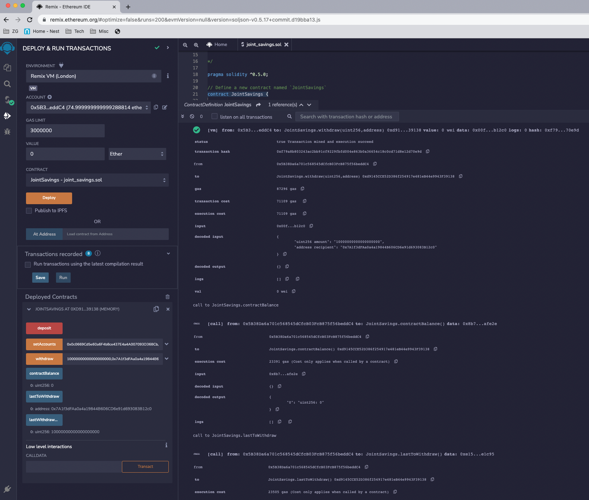

# joint_savings_contract
Solidity Contract implementation of a Joint Savings Account

Deployed Solidity Contract:

Called Set Accounts function to set joint savings accounts:

Made Deposit of 1 ETH in Wei to Contract:

Made Deposit of 10 ETH in Wei to Contract:

Made Deposit of 5 ETH in Wei to Contract:

Made Deposit of 10 ETH in Wei to Contract:

Made Withdrawal of 5 ETH in Wei to Contract:

Made Withdrawal of 10 ETH in Wei to Contract:

